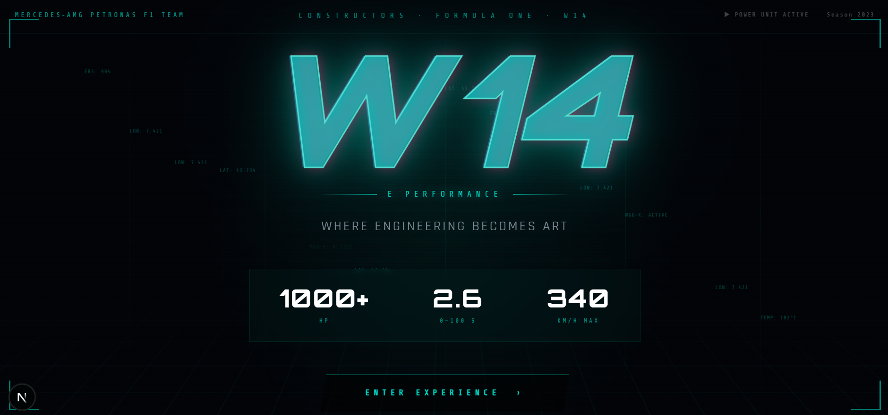
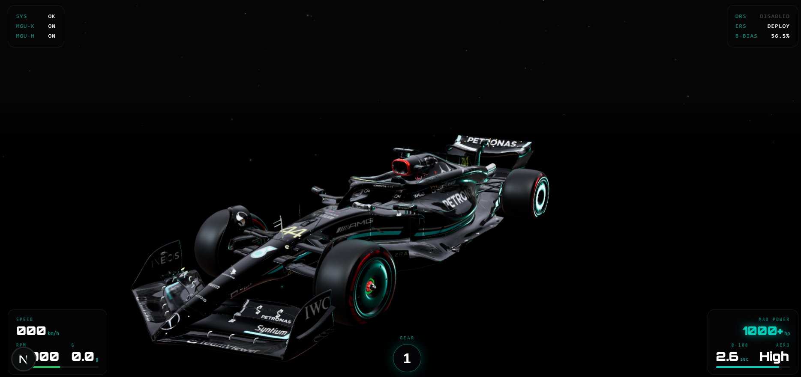
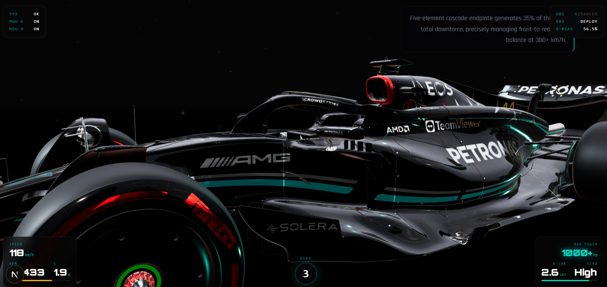
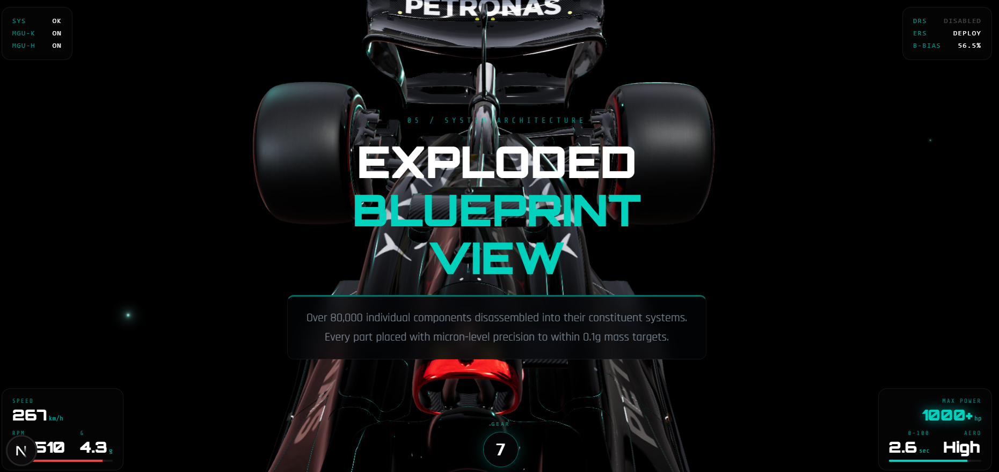
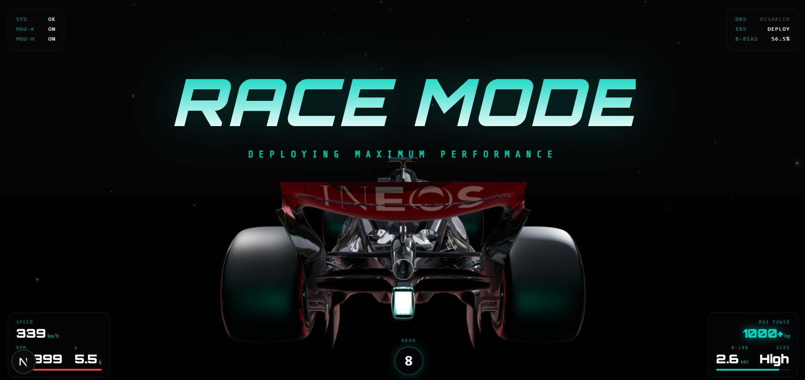

# F1® "Night Tech" 3D Viewer

A hyper-realistic, scroll-driven 3D web experience designed to showcase an F1 Power Unit and chassis architecture using modern web technologies. Engineered with a brutalist "Mercedes-AMG Hacker" aesthetic.

**Live Demo: [f1-amg.nikstu.tech](https://f1-amg.nikstu.tech/)**




## Overview

This project pushes the boundaries of web-based 3D rendering and storytelling. Rather than a static model or standard turntable, the F1 "Night Tech" viewer uses deep GSAP timeline synchronization linked directly to user scrolling to meticulously reconstruct a Formula 1 car part-by-part.

The experience is accompanied by a generative, aggressive V6 engine telemetry system that dynamically responds to interaction.




## Core Features

- **Telemetry Audio Engine**: A custom Web Audio API synthesizer that generates high-fidelity telemetry pings and F1 frequency blips (zero external audio assets used).
- **Cinematic Scrollytelling**: 8 distinct GSAP `ScrollTrigger` camera maneuvers perfectly choreographed to the DOM flow, culminating in an intricate "Exploded Blueprint View" separating components into mass vectors.
- **Aggressive Night-Tech Aesthetics**: A bespoke dark mode UI featuring glowing '#00D2BE' teal highlights, raw data telemetry, and precision grid overlays mirroring Mercedes-AMG Petronas F1 visual guidelines.
- **Dynamic HUD**: HTML overlays locked directly onto 3D world coordinates for absolute precision, complete with real-time scaling and perspective rendering via `@react-three/drei`.
- **Infrastructure Optimization**: Large-scale 3D assets are offloaded to **Vercel Blob Storage** to ensure high-performance delivery and minimal server-side bandwidth consumption.



## Technology Stack

- **Framework**: `Next.js 15` (App Router)
- **3D Engine**: `Three.js` + `@react-three/fiber`
- **Animation**: `GSAP` + `ScrollTrigger`
- **Storage**: Vercel Blob (CDN for 3D Models)
- **Styling**: Native CSS
- **Audio**: Web Audio API `AudioContext`
- **Deployment**: Vercel

## Local Development

```bash
# Install dependencies
npm install

# Start the dev server
npm run dev
```

Open [http://localhost:3000](http://localhost:3000) with your browser to see the result. Scroll down smoothly to experience the timeline injection!

## Deployment

This project is fully optimized for Vercel. By leveraging Vercel Blob for 20MB+ assets, the application maintains a lightning-fast "First Contentful Paint" while keeping the main deployment footprint small and efficient.
