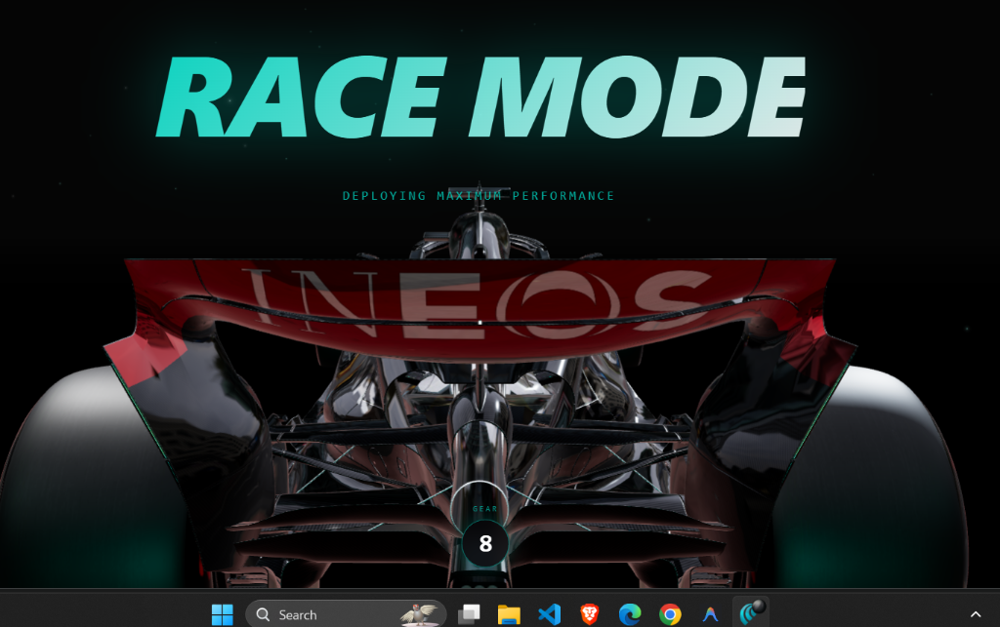

# F1® "Night Tech" 3D Viewer

A hyper-realistic, scroll-driven 3D web experience designed to showcase an F1 Power Unit and chassis architecture using modern web technologies. Engineered with a brutalist "Mercedes-AMG Hacker" aesthetic.


## Overview

This project pushes the boundaries of web-based 3D rendering and storytelling. Rather than a static model or standard turntable, the F1 "Night Tech" viewer uses deep GSAP timeline synchronization linked directly to user scrolling to meticulously reconstruct a Formula 1 car part-by-part.

The experience is accompanied by a generative, aggressive V6 Turbo Hybrid audio engine that dynamically responds to interaction.



## Core Features

- **Generative V6 Turbo Audio Engine**: A custom Web Audio API synthesizer that dynamically generates aggressive Formula 1 engine sounds with mathematically simulated turbo-whine, distortion bites, and resonance clipping (zero external MP3 assets used).
- **Cinematic Scrollytelling**: 8 distinct GSAP `ScrollTrigger` camera maneuvers perfectly choreographed to the DOM flow, culminating in an intricate "Exploded Blueprint View" separating 80,000 components into mass vectors.
- **Aggressive Night-Tech Aesthetics**: A bespoke dark mode UI featuring glowing '#00D2BE' teal highlights, raw data telemetry, and precision grid overlays mirroring Mercedes-AMG Petronas F1 visual guidelines.
- **Dynamic HUD**: HTML overlays locked directly onto 3D world coordinates for absolute precision, complete with real-time scaling and perspective rendering via `@react-three/drei`.
- **Absolute CSS Rendering**: Eliminated jittery JS-based sticky effects in favor of bulletproof native CSS DOM layout for high-performance typography scaling and absolute positioning.


## Technology Stack

- **Framework**: `Next.js 15` (App Router)
- **3D Engine**: `Three.js` + `@react-three/fiber`
- **Animation**: `GSAP` + `ScrollTrigger`
- **Styling**: Native CSS Modules + Flexbox/Grid
- **Audio**: Web Audio API `AudioContext`
- **Deployment**: Vercel

## Local Development

```bash
# Install dependencies
npm install

# Start the dev server
npm run dev
```

Open [http://localhost:3000](http://localhost:3000) with your browser to see the result. Scroll down smoothly to experience the timeline injection and audio synthesis!

## Deployment

This project is fully optimized for Vercel. With WebGL textures and logic heavily offloaded to the client GPU, the server footprint natively fits inside standard serverless edge constraints.
